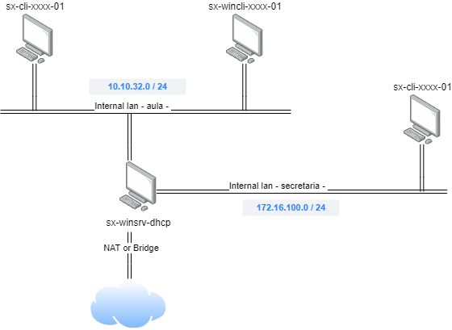

# 📎 UD01P03.- Configuració de dues xarxes local amb DHCP Linux

## Objectiu

L'objectiu de la pràctica és simular el següent escenari de xarxa, amb VirtualBox:

<figure><figcaption></figcaption></figure>

### Requisits:

Hem de configurar almenys 3 màquines virtuals:

* 1 client amb LUbuntu 22.0, conectat a la xarxa interna aula
* 1 client amb Windows 10, conectat a la xarxa interna secretaria
* 1 servidor amb Ubuntu Server 22.04, conectat a les dues xarxes internes, i a NAT&#x20;

Les dues màquines virtuals client estaran connectades a la seva xarxa interna, amb una interfície de xarxa configurada amb IP dinàmica. Rebran de la màquina server almenys els següents paràmetres:

* IP
* Mascara de xarxa
* Porta d'enllaç
* Servidors DNS

La numeració de les màquines client de la xarxa aula rebran una IP entre la 100 i la 125. La numeració de les màquines client de la xarxa secretaria rebran una IP entre la 150 i la 175.

Les targetes de xarxa de les xarxes internes del servidor estaran configurades de manera estàtica. Les IP de la màquina server hauran de correspondre amb les IP de porta d'enllaç per defecte de les xarxes.

Hem de configurar la màquina server perquè actue com a porta d'enllaç amb l'exterior.  Per a aconseguir-ho caldrà:

* Afegir-li una tercera interfície de xarxa en mode NAT o bridge (de VirtualBox).
* Instal·lar i configurar els paquets necessaris perquè la màquina funcione com a "gateway" per a la resta de màquines de les xarxes 'aula' i 'secretaria' (la resta de màquines podran accedir a Internet).&#x20;

### Format de l'entrega

* Opció 1: crear un document PDF.
* Opció 2: Gravar un vídeo.

En ambdós casos l'entrega haurà d'incloure:

* L'explicació detallada de totes les accions realitzades per poder configurar l'escenari, justificant-les.
* Mostrar els fitxers de la configuració de la xarxa, així com els comandaments emprats per aplicar la configuració, i per a provar el correcte funcionament.
* L'explicació detallada de totes les accions realitzades per poder configurar el servidor DHCP, justificant-les.
* Demostrar que els clients i el servidor es comuniquen.
* Demostrar que els clients poden accedir a internet a través del servidor.
