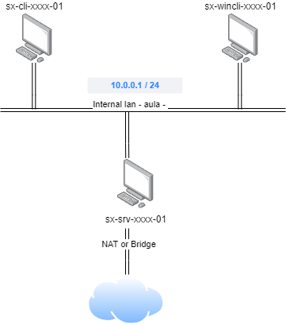

# 📎 UD02P01.- Configuració d'un servidor DNS Linux

## Objectiu

L'objectiu de la pràctica és configurar el següent escenari al servidor DNS, amb VirtualBox:

<figure><figcaption></figcaption></figure>

### Requisits:

Hem de configurar 3 màquines virtuals:

* 1 client amb LUbuntu 22.0
* 1 client amb Windows 10
* 1 servidor amb Ubuntu Server 24.04

Les dues màquines virtuals client estaran connectades a la xarxa interna 'aula', amb una interfície de xarxa configurada amb IP estàtica i servidor DNS configurat a mà.&#x20;

La numeració de les màquines client començarà per la x=75, i amb x màxima 100.

La targeta de xarxa de la xarxa interna del servidor estarà configurada de manera estàtica. La IP de la màquina server haurà de correspondre amb la IP de porta d'enllaç per defecte de la xarxa.

Hem de configurar la màquina server perquè actue com a servidor DNS, amb forward de peticions a l'exterior.  Per a aconseguir-ho caldrà:

* Afegir-li una segona interfície de xarxa en mode NAT o bridge (de VirtualBox).
* Instal·lar i configurar els paquets necessaris perquè la màquina funcione com a servidor DNS per a la resta de màquines de la xarxa 'aula' (la resta de màquines podran fer consultes DNS).&#x20;

Hem de configurar almenys, les següents direccions al servidor DNS:

* La IP del servidor DNS
* La IP del servidor Gateway
* La IP del client windows.
* La IP del client Linux.
* La IP de la impressora (La IP deu concordar amb el nom del teu PC a classe)

### Format de l'entrega

* Opció 1: crear un document PDF.
* Opció 2: Gravar un vídeo.

En ambdós casos l'entrega haurà d'incloure:

* L'explicació detallada de totes les accions realitzades per poder configurar l'escenari, justificant-les.
* Mostrar els fitxers de la configuració de la xarxa, així com els comandaments emprats per aplicar la configuració, i per a provar el correcte funcionament.
* L'explicació detallada de totes les accions realitzades per poder configurar el servidor DNS, justificant-les.
* Demostrar que els clients poden resoldre DNS internes i externes, de manera directa i inversa.
