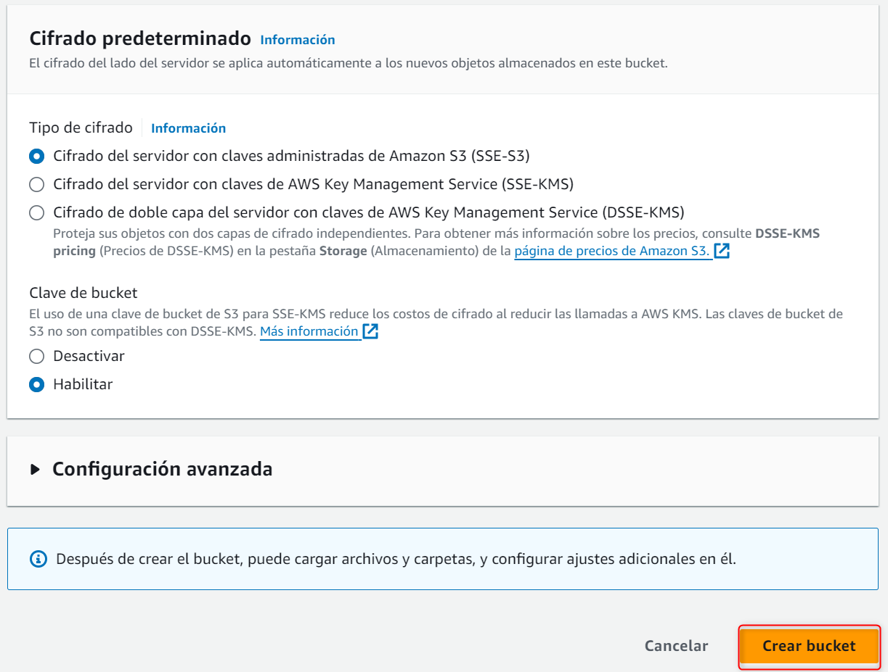

# ⚒ UD04.02.01.- Instal·lació del servei IIS.

Per a instal·lar IIS a Windows Server 2022, hem d'afegir el servei amb l'aplicació Server Manager.

<figure><figcaption>
Accés a l'aplicació 'Server manager'
</figcaption></figure>

Al server Manager, seleccionem l'opció 'Manage' -> 'Add Roles and Features'

<figure><figcaption>
Afegir nova funcionalitat a Windows Server
</figcaption></figure>

A la finestra oberta, seguim les instruccions de l'assistent.

<figure><figcaption>
Afegir rol o funcionalitat
</figcaption></figure>

<figure><figcaption>
Selecció de tipus d'instal·lació
</figcaption></figure>

<figure><figcaption>
Selecció de servidor
</figcaption></figure>

<figure><figcaption>
Selecció del servei IIS
</figcaption></figure>

<figure><figcaption>
Confirmació de característiques seleccionades
</figcaption></figure>

<figure><figcaption>
Selecció del servei IIS
</figcaption></figure>

<figure><figcaption>
Confirmació de funcionalitats a instal·lar
</figcaption></figure>

<figure><figcaption>
Assistent d'instal·lació de IIS
</figcaption></figure>

<figure><figcaption>
Assistent d'instal·lació de IIS
</figcaption></figure>

<figure><figcaption>
Confirmació de la instal·lació
</figcaption></figure>

Quan confirmem la instal·lació, haurem d'esperar fins que finalitze la mateixa

<figure><figcaption>
Confirmació de finalització del procés d'instal·lació
</figcaption></figure>

Tanquem l'assistent, i podem provar el servei, accedint a la IP pública de la instància EC2.

<figure><figcaption>
Pàgina per defecte a IIS
</figcaption></figure>

El navegador ens ha mostrat la pàgina publicada a la carpeta c:\inetpub\wwwroot\\

<figure><figcaption>
Directori de publicació per defecte a IIS
</figcaption></figure>

