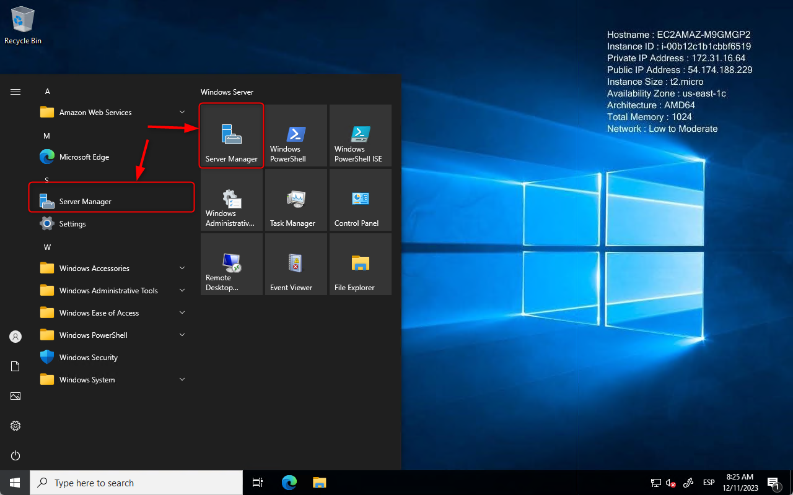

# ⚒ UD04.03.- Desplegament d'una web estàtica a Amazon S3

## Introducció.

S3 (Simple Storage Service) és un servici de disc virtual a AWS, que permet emmagatzemar i recuperar fitxers al núvol, de forma senzilla.&#x20;

Entre les seues funcionalitats, podem trobar l'allotjament de webs estàtiques.

### Creació d'un bucket S3.

Al panell principal d'AWS, seleccionem el servei S3.

<figure><figcaption><p>Selecció del servei S3</p></figcaption></figure>

Al panell principal de S3, polsem sobre el botó 'Crear Bucket'.

<figure><figcaption><p>Opció per a crear un Bucket</p></figcaption></figure>

Al formulari de creació, introduïm el nom del nostre bucket (a l'exeple hem fet servir bucket.jorgelopez.sx).

<figure><figcaption><p>Configuració del nom del bucket</p></figcaption></figure>

Fem scroll fins a arribar al final de la pàgina, i polsem sobre el botó 'crear bucket'.&#x20;

<figure><figcaption><p>Confirmació de la creació del bucket</p></figcaption></figure>

Tornarem al panell de S3, on podrem visualitzar el llistat dels nostres buckets.

<figure><figcaption><p>Llistat de buckets configurats al servei S3</p></figcaption></figure>

### Habilitar la funcionalitat d'allotjament de web estàtica.

Al panell de S3, polsem sobre el nom del bucket que volem fer servir com a 'servidor HTTP'.

<figure><figcaption><p>Llistat de buckets configurats al servei S3</p></figcaption></figure>

Polsem la pestanya 'Propietats'

<figure><figcaption><p>Propietats del bucket</p></figcaption></figure>

Fem scroll a la pàgina de propietats, fins a arribar a l'opció 'Allotjament de llocs web estàtics', i polsem el botó 'Editar'.

<figure><figcaption><p>Edició de les opcions d'allotjament de web estàtica</p></figcaption></figure>

Ens mostrarà un formulari, per configurar les opcions de publicació del bucket. Hem d'habilitar l'allotjament, i configurar el nom dels documents index i error:

<figure><figcaption><p>Configuració de lloc estàtic</p></figcaption></figure>

Una volta configurat, polsarem sobre el botó 'Guardar canvis'.

<figure><figcaption><p>Guardar canvis</p></figcaption></figure>

Tornarem a la pàgina de propietats, a on podem tornar a fer scroll, fins a arribar a la secció 'allotjament de llocs web estàtics', a on podrem observar l'URL HTTP del nostre bucket.

<figure><figcaption><p>URL HTTP del nostre bucket</p></figcaption></figure>


Si polsem sobre l'URL rebrem un error, donat que encara no hem finalitzat la configuració.


### Editar la configuració d'accés públic

Per defecte, el servei S3 bloqueja l'accés públic a tots els buckets, i per això hem d'editar la configuració de bloqueig d'accés públic del nostre bucket.

Haurem d'entrar a la configuració del bucket, a la pestanya permisos, i polsar sobre el botó editar.

<figure><figcaption><p>Edició de permisos del bucket</p></figcaption></figure>

A la pàgina d'edició, desactivem el bloqueig, i polsem el botó 'Guardar  canvis'

<figure><figcaption><p>Desactivació del bloqueig d'accés</p></figcaption></figure>

Tornarem a la pàgina de permisos del bucket, en la qual haurem d'afegir una política de bucket, polsant el botó 'editar'.

<figure><figcaption><p>Accés a l'edició de la política d'accés al bucket</p></figcaption></figure>

Hem d'incloure la següent política de bucket, modificant el nom del bucket a l'exemple.

```json
{
    "Version": "2012-10-17",
    "Statement": [
        {
            "Sid": "PublicReadGetObject",
            "Effect": "Allow",
            "Principal": "*",
            "Action": [
                "s3:GetObject"
            ],
            "Resource": [
                "arn:aws:s3:::Bucket-Name/*"
            ]
        }
    ]
}
```

Introduïm la política a l'editor web, i polsem el botó 'guardar canvis'.

<figure><figcaption><p>Edició de la política d'accés al bucket</p></figcaption></figure>

### Publicació de la nostra web

Per a publicar la nostra web, accedim a la configuració del bucket, a la pestanya objectes, i polsar sobre el botó 'carregar'.

<figure><figcaption><p>Panell d'objectes del bucket</p></figcaption></figure>

Polsem sobre el botó 'agregar fitxers' i seleccionem els fitxers de la nostra web (a l'exemple, index.html i error.html).

<figure><figcaption><p>Transferència de fitxers al bucket</p></figcaption></figure>

A partir d'ara, qualsevol persona podrà accedir a l'URL del bucket, per visitar la nostra pàgina web desplegada al servei S3, sense necessitat de desplegar i configurar un servidor HTTP.

<figure><figcaption><p>Prova d'accés a la pàgina desplegada a S3</p></figcaption></figure>
