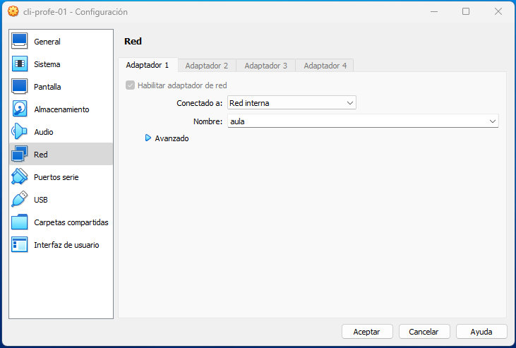

# ⚒️ Configuració de xarxa a Ubuntu 24.04

Partim d'una màquina virtual, amb un sistema operatiu basat a Ubuntu 22.04, i que té configurada una interfície de xarxa connectada a la xarxa interna 'aula'.

<figure><figcaption><p>Configuració de la interfície de xarxa a VirtualBox</p></figcaption></figure>

Obrim un terminal, per a fer les operacions de configuració:

* [ ] Comprovem el nom assignat a la targeta de xarxa:

```bash
profe@sx-cli-profe01:~$ ip a;
1: lo: <LOOPBACK,UP,LOWER_UP> mtu 65536 qdisc noqueue state UNKNOWN group default qlen 1000
    link/loopback 00:00:00:00:00:00 brd 00:00:00:00:00:00
    inet 127.0.0.1/8 scope host lo
       valid_lft forever preferred_lft forever
    inet6 ::1/128 scope host 
       valid_lft forever preferred_lft forever
2: enp0s3: <BROADCAST,MULTICAST,UP,LOWER_UP> mtu 1500 qdisc fq_codel state UP group default qlen 1000
    link/ether 08:00:27:df:63:c6 brd ff:ff:ff:ff:ff:ff
    inet 192.168.0.101/24 brd 192.168.0.255 scope global noprefixroute enp0s3
       valid_lft forever preferred_lft forever
    inet6 fe80::a00:27ff:fedf:63c6/64 scope link 
       valid_lft forever preferred_lft forever
```

En aquest cas, podem observar que existeixen dues targetes de xarxa:

* lo: referència a la xarxa de loopback (localhost)
* <mark style="background-color:orange;">**enp0s3**</mark>: referència a la targeta de xarxa afegida a VirtualBox

- [ ] Editem el fitxer de configuració de la xarxa, localitzar a la ruta **/etc/netplan/** amb el nostre editor de text preferit, i **amb permisos d'administrador** (fent servir sudo, si cal):

```bash
profe@sx-cli-profe01:~$ sudo vi /etc/netplan/01-network-manager-all.yaml
password: 
```

Al fitxer, respectant el format Yaml, haurem d'incloure els paràmetres de configuració de la targeta de xarxa. Per a l'exemple, configurarem la direcció estàtica 192.168.0.101/24, i deshabilitarem que el sistema demane una nova IP al servidor DCHP.

```yaml
# Let NetworkManager manage all devices on this system
network:
  version: 2
  renderer: NetworkManager
  ethernets:
    enp0s3:
      addresses:
      - 192.168.0.101/24
      dhcp4: false
```

Hem de respectar els espais de tabulat perquè la configuració funcione correctament. Si deixem un espai de més o de menys, la configuració no es podrà aplicar.

* [ ] Apliquem la configuració:

Executem el comandament **netplan**, **amb permisos d'administrador** (fent servir sudo, si cal), per aplicar la configuració introduïda.

```bash
profe@sx-cli-profe01:~$ sudo netplan apply
```

* [ ] A continuació podem comprovar que la configuració ha sigut aplicada correctament:

Podem fer la comprovació executant diversos comandaments:

* Amb el comandament ifconfig:

```bash
profe@sx-cli-profe01:~$ ifconfig
enp0s3: flags=4163<UP,BROADCAST,RUNNING,MULTICAST>  mtu 1500
        inet 192.168.0.101  netmask 255.255.255.0  broadcast 192.168.0.255
        inet6 fe80::a00:27ff:fedf:63c6  prefixlen 64  scopeid 0x20<link>
        ether 08:00:27:df:63:c6  txqueuelen 1000  (Ethernet)
        RX packets 58  bytes 3850 (3.8 KB)
        RX errors 0  dropped 0  overruns 0  frame 0
        TX packets 125  bytes 14316 (14.3 KB)
        TX errors 0  dropped 0 overruns 0  carrier 0  collisions 0

lo: flags=73<UP,LOOPBACK,RUNNING>  mtu 65536
        inet 127.0.0.1  netmask 255.0.0.0
        inet6 ::1  prefixlen 128  scopeid 0x10<host>
        loop  txqueuelen 1000  (Bucle local)
        RX packets 125  bytes 10525 (10.5 KB)
        RX errors 0  dropped 0  overruns 0  frame 0
        TX packets 125  bytes 10525 (10.5 KB)
        TX errors 0  dropped 0 overruns 0  carrier 0  collisions 0
```

* Amb el comandament ip a:

```bash
profe@sx-cli-profe01:~$ ifconfig
enp0s3: flags=4163<UP,BROADCAST,RUNNING,MULTICAST>  mtu 1500
        inet 192.168.0.101  netmask 255.255.255.0  broadcast 192.168.0.255
        inet6 fe80::a00:27ff:fedf:63c6  prefixlen 64  scopeid 0x20<link>
        ether 08:00:27:df:63:c6  txqueuelen 1000  (Ethernet)
        RX packets 58  bytes 3850 (3.8 KB)
        RX errors 0  dropped 0  overruns 0  frame 0
        TX packets 125  bytes 14316 (14.3 KB)
        TX errors 0  dropped 0 overruns 0  carrier 0  collisions 0

lo: flags=73<UP,LOOPBACK,RUNNING>  mtu 65536
        inet 127.0.0.1  netmask 255.0.0.0
        inet6 ::1  prefixlen 128  scopeid 0x10<host>
        loop  txqueuelen 1000  (Bucle local)
        RX packets 125  bytes 10525 (10.5 KB)
        RX errors 0  dropped 0  overruns 0  frame 0
        TX packets 125  bytes 10525 (10.5 KB)
        TX errors 0  dropped 0 overruns 0  carrier 0  collisions 0
```

* [ ] Si la configuració és correcta, tindrem connectivitat amb altres sistemes operatius connectats a la mateixa xarxa:

Podem executar el comandament **ping**, amb destí a altra màquina **configurada a la mateixa xarxa**, i comprovar la resposta:

```bash
profe@sx-cli-profe01:~$ ping 192.168.0.102
PING 192.168.0.102 (192.168.0.102) 56(84) bytes of data.
64 bytes from 192.168.0.102: icmp_seq=1 ttl=64 time=3.41 ms
64 bytes from 192.168.0.102: icmp_seq=2 ttl=64 time=0.986 ms
64 bytes from 192.168.0.102: icmp_seq=3 ttl=64 time=0.851 ms
```
