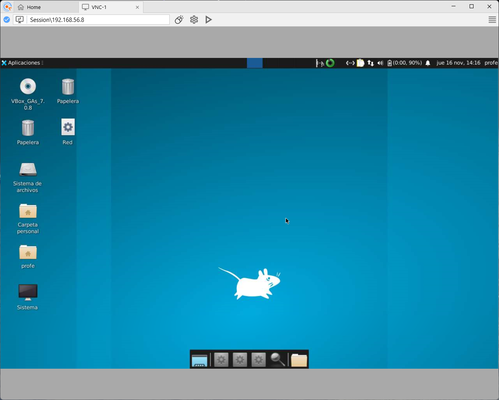

# ⚒ Connectar des de Windows a un escriptori remot VNC

Una volta hem habilitat l'acces a l'escriptori remot a un sistema Linux, amb el servei VNC, podem fer servir qualsevol client VNC per a connectar al mateix.

Al present exemple, farem servir la versió de Windows del client Remote Ripple, de l'equip que desenvolupa TightVNC.

* [ ] Descarrega i instal·lació del client:

Per a descarregar i instal·lar el client Remote Ripple, accedim a la [pàgina de descàrregues del producte](https://remoteripple.com/download/) i seleccionem la versió corresponent al nostre sistema operatiu.

<figure><figcaption>
Pàgina de descàrregues de remote ripple
</figcaption></figure>

Una volta descarregat, executem l'instal·lador i seguim les instruccions de l'aplicatiu.

* [ ] Connexió a l'escriptori remot

Per a connectar a l'escriptori remot, obrim el programari Remote Ripple, i configurem la connexió, pulsant sobre el text "New Session..."

<figure><figcaption>
Crear nova connexió
</figcaption></figure>

Introduïm les dades de connexió al servidor, tenint en compte que hem de connectar al port 5901, i polsem el botó "Connect".

<figure><figcaption>
Configuració de les dades de connexió
</figcaption></figure>

En connectar a l'escriptori remot, l'aplicació ens demanarà la contrasenya configurada al servei VNC.

<figure><figcaption>
Sol·licitud de contrasenya d'accés a l'escriptori remot.
</figcaption></figure>

Una volta introduïda la contrasenya, podrem treballar amb l'entorn gràfic, com si estiguérem físicament davant del host.

<figure><figcaption>
Escriptori remot
</figcaption></figure>

