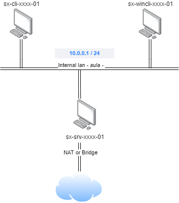

# 📎 UD03P02.- Configuració i ús d'un servei d'escriptori remot amb VNC

## Objectiu

L'objectiu de la pràctica és configurar el següent escenari, amb VirtualBox:

<figure><figcaption></figcaption></figure>

### Requisits:

Hem de configurar 3 màquines virtuals:

* 1 client amb LUbuntu 22.0, al que instal·larem vnc server
* 1 client amb Windows 10
* 1 client amb LUbuntu 24.04

Les tres màquines virtuals client estaran connectades a la xarxa interna 'aula', amb IP estàtica.

Hem de configurar l'accés remot amb VNC, a un dels clients Ubuntu.

Una volta configurat el nostre accés remot, mostrarem com fer les següents operacions:

* Connectar des d'un altre client LUbuntu a l'escriptori remot, i crear una carpeta nova dins del directori arrel de l'usuari.
* Comprovar al host amb escriptori  remot que el directori es pot accedir sense problemes.
* Connectar des d'un client Windows, i crear un document de text nou dins del directori creat anteriorment.
* Comprovar al host amb escriptori remot que el document es pot accedir sense problemes, i podem consultar el contingut

### Format de l'entrega

* Gravar un vídeo d'entre 5 i 10 minuts, explicant la configuració aplicada, i mostrant el funcionament.&#x20;

El vídeo haurà d'incloure:

* L'explicació detallada de totes les accions realitzades per poder configurar l'escenari, justificant-les.
* Mostrar els fitxers de la configuració de la xarxa, així com els comandaments emprats per aplicar la configuració, i per a provar el correcte funcionament.
* L'explicació detallada de totes les accions realitzades per poder configurar el servidor VNC, justificant-les.
* Demostrar que els clients poden connectar amb un client VNC, seguint les especificacions donades.
